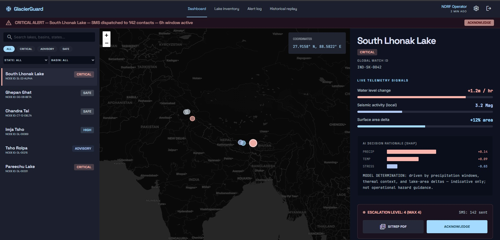

# GlacierGuard

## Dashboard

---

## Table of contents

- [Dashboard](#dashboard)
- [The problem it addresses](#the-problem-it-addresses)
- [What it does and does not do](#what-it-does-and-does-not-do)
- [Tech stack](#tech-stack)
- [How the system works](#how-the-system-works)
- [References](#references)

---

## The problem it addresses

- There are **many mapped glacial lakes** in mountain regions, but only a **small share** are watched continuously with field instruments.
- Teams need a **repeatable way to prioritise** which lakes deserve attention, using open data and clear reasoning—not guesswork or a single opaque score.
- **Downstream valleys** matter for impact, but not every workflow connects satellite-style signals to **who lies along possible flow paths**.

---

## What it does and does not do

| It aims to | It does not claim to |
|------------|----------------------|
| Support **screening and prioritisation** (“where to look next”) | Replace **validated, site-level early warning** run by agencies |
| Combine **open geospatial and weather context** with a **map-first** dashboard | Provide **continuous real-time** satellite monitoring of every lake |
| Make **trade-offs visible** so results can be reviewed and questioned | **Predict** a specific breach time or substitute for **engineering flood models** |

---

## Tech stack

What the repository uses **today** in the web app (`frontend/`):

- **React** — UI
- **Vite** — dev server and build
- **TypeScript** — typed components
- **Tailwind CSS** — styling
- **Leaflet** & **React Leaflet** — map
- **React Router** — navigation

---

## How the system works

Scheduled or on-demand jobs **pull open earth-observation and weather data**, build **per-lake indicators over time**, **score** unusual patterns and attach **short explanations**, sketch **simple downstream paths** from terrain for map context, and **show everything in the dashboard** (and optionally alert channels when wired up).

---

## References

- Lützow, N. & Veh, G. — *Glacier Lake Outburst Flood Database* v3.0 — [DOI 10.5281/zenodo.7330345](https://doi.org/10.5281/zenodo.7330345) — [event map](http://glofs.geoecology.uni-potsdam.de)
- Lundberg, S. M. & Lee, S.-I. (2017) — model explanations (SHAP / TreeSHAP)
- Background context for talks and docs: [resources/information.md](resources/information.md)
